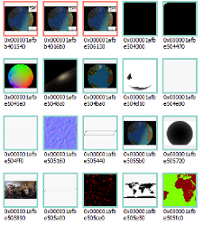

# Creating an image

In [the buffers creation section of the book](../03-buffer-creation/01-buffer-creation.html) we
saw that in order for the GPU to access data we had to put it in a *buffer*.
This is not exactly true, as there is an alternative which are ***images***.

An *image* in the context of Vulkan designates a multidimensional array of pixels.
There are various hardcoded formats that the pixels of an image can use.

<center>


*Example: the various images used by a Vulkan-using<br />
application, as seen from a debugger*

</center>

We often use Vulkan images to store *images* in the common sense of the word, in which case each
value of the array contains the color of the pixel. However Vulkan images can also be used to store
arbitrary data (in other words, not just colors).

> **Note**: Pixels inside images are sometimes called **texels**, which is short for
> "texture pixel". **Textures** are a more specialized alternative to images but that no longer
> exist in Vulkan. The word "texel" has been less and less used over time, but the word "texture"
> is still very common.

## Properties of an image

While we often think of images as being two-dimensional, in the context of Vulkan they can also be
one-dimensional or three-dimensional. The dimensions of an image are chosen when you create it.

> **Note**: There are two kinds of three-dimensional images: actual three-dimensional images, and
> arrays of two-dimensional layers. The difference is that with the former the layers are expected
> to be contiguous, while for the latter you can manage layers individually as if they were
> separate two-dimensional images.

When you create an image you must also choose a format for its pixels. Depending on the format, the
pixels of an image can have between one and four components. In other words each pixel is an array
of one to four values. The four components are named, in order, R, G, B and A.

> **Note**: If you are familiar with RGBA, it may seem obvious to you that the R component
> (the first) is supposed to contain the red value of the pixel, the G component (the second) is
> supposed to contain the green value of the pixel, and same for blue and alpha. However remember
> that we can store arbitrary data in this format instead of colors.

You can check [the list of available formats
here](https://docs.rs/vulkano/0.34.0/vulkano/format/enum.Format.html).

For example if you create an image with the format `R8_SINT`, then it will only have one component.
But with the format `A2R10G10B10_SSCALED_PACK32`, you have all four components. The first part of 
the name of each format corresponds to the memory layout of the four components. For example with
`B10G11R11_UFLOAT_PACK32`, each pixel is 32 bits long where the first 10 bits is the blue component,
the next 11 bits are the green component, and the last 11 bits are the red component. Don't worry
if you are confused, as we will only use the most simple formats in this book.

## Image creation

Similar to buffers, images are created by providing information about the image and allocation.
However, unlike buffers, images always begin in an uninitialized state.

```rust
use vulkano::image::{ImageDimensions, Image};
use vulkano::format::Format;

let image = Image::new(
    memory_allocator.clone(),
    ImageCreateInfo {
        image_type: ImageType::Dim2d,
        format: Format::R8G8B8A8_UNORM,
        extent: [1024, 1024, 1],
        usage: ImageUsage::TRANSFER_DST | ImageUsage::TRANSFER_SRC,
        ..Default::default()
    },
    AllocationCreateInfo {
        memory_type_filter: MemoryTypeFilter::PREFER_DEVICE,
        ..Default::default()
    },
)
.unwrap();
```

We pass the dimensions of the image and the desired format. Just like buffers, images also need to
be created with flags that describe how the image will be used, and using it in a way that wasn't
specified when creating it will result in an error.

Next: [Clearing an image](02-image-clear.html)
